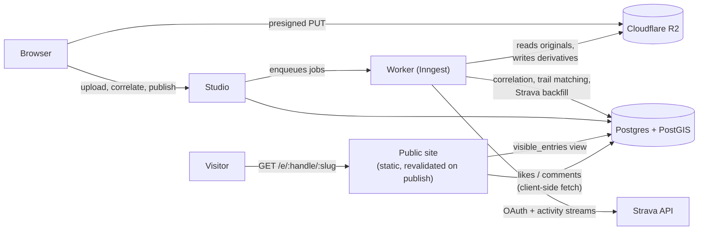
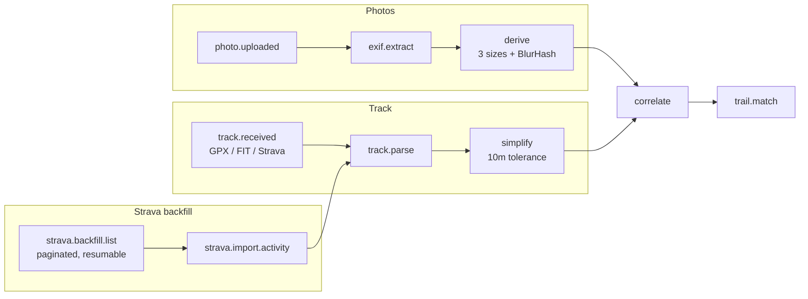

# Waypoint

Dedicated cameras take the best photographs and record the worst metadata. A mirrorless body
writes a capture timestamp and nothing else; the GPS track of the same walk lives in a watch.
Waypoint joins the two — it correlates photo capture times against a GPS track to place every
frame on the route, then builds a journal of outings and trail pages that accumulate visits
over time.

Signup is closed while the product is in beta; accounts are created from invite codes.

## Stack

| Concern | Choice |
|---|---|
| Application | Next.js (TypeScript, App Router) |
| Database | Postgres 16 + PostGIS |
| Object storage | Cloudflare R2 |
| Maps | MapLibre GL + MapTiler |
| Background jobs | Inngest |

The correlation engine is a dependency-free TypeScript library with no database or DOM
coupling, so it is unit-testable against fixtures and can later run on a native client.

## Layout

```
apps/web/            Next.js application
packages/            shared libraries (correlation engine and friends)
db/migrations/       SQL migrations, applied on first boot of the dev database
scripts/             development and verification tooling
fixtures/            GPX tracks and JPGs used by the test suite (untracked)
```

## Architecture

Four pieces, chosen so a 30&nbsp;MB photo batch and a rate-limited third-party
API never sit in the request path of a page a stranger is loading from a
shared link.



- **Public site** and **studio** are the same Next.js deployment, split by
  whether a route is session-gated. Public pages are statically generated
  and revalidated on publish, so a burst of traffic from a shared link never
  touches Postgres — likes and comments are the one exception, fetched
  client-side into reserved space rather than baked into the page (see
  below).
- **The worker** (Inngest) owns everything that shouldn't block an HTTP
  response: EXIF extraction, image derivatives, correlation, trail
  matching, and the paginated Strava backfill. Nothing in this list runs in
  a Vercel function.
- **R2** takes uploads directly from the browser via presigned URLs, so an
  original photo never passes through a serverless request body.

### The job graph

Correlation is a fan-in: it can't resolve a timezone offset from one
photograph in isolation, so it waits for every photo in a batch to have an
extracted timestamp *and* for the track to finish parsing before it runs.



A failed EXIF read marks that one photo `failed` and excludes it from
offset scoring rather than blocking the batch — a batch-level decision like
the timezone search below can't be made photo-by-photo, so one bad file
should not stall the rest.

### Why likes and comments are not baked into the page

Entry pages are read far more often than they're written to, so they're
statically generated. Likes and comments are the opposite — they change
whenever someone visits — and a counter baked into the static HTML would
mean regenerating the page on every like. So the page ships without them
and fetches `/api/entries/:id/social` on mount into a reserved space:
the expensive thing (the page) stays cached, the cheap thing (a count)
stays fresh, and nothing shifts on arrival.

## Correlating photos to a GPS track

This is the hard part, and it lives in `packages/correlation` as a
dependency-free TypeScript library — no database, no DOM — so it can be
unit-tested against fixtures and, eventually, run on-device in a native
client before a photo is ever uploaded.

**The problem is timezone, not clock drift.** A camera's `DateTimeOriginal`
is a naive local timestamp with no zone attached; a GPS track's points are
UTC. A photo taken at 14:32 in Colorado is six *hours* from its track
position, not six seconds — so the engine can't just nudge for drift, it
has to work out what "14:32" meant.

**It searches rather than asks.** Every real-world UTC offset exists in
15-minute steps (Nepal is +05:45, Chatham Islands +12:45 — whole hours
aren't enough), so the engine tries all of them, shifts every photo
timestamp by each candidate, and scores how many land inside the
activity's time window.

**The search usually doesn't return one answer, and that's expected, not
a bug.** The naive version of this — return the highest-scoring offset —
is confidently wrong on the most common input shape: a handful of
photographs taken in the middle of a multi-hour hike, leaving slack at
both ends of the window that many adjacent offsets all satisfy equally.
Measured against real outings, against a real Garmin track and real
camera frames:

| Outing | Photos | Candidates placing all of them | Admissible range |
|---|---|---|---|
| 5.5 h hike | 2 | 24 of 105 | UTC−9 to UTC−3:15 |
| 7.5 h hike | 6 | 27 of 105 | UTC−9:45 to UTC−3:15 |
| 12.8 h hike | 1 | 38 of 105 | UTC−12 to UTC−2:45 |

A tiebreak that just picks the candidate closest to UTC — the obvious way
to make this deterministic — returned **UTC−3:15 for a hike in Colorado**,
placing every photo on a part of the route walked nearly three hours
later. So the engine doesn't pick one: it returns the whole **admissible
set**, and resolves it in order:

1. One admissible candidate — done, unambiguous.
2. Several, and the photo carries an EXIF `OffsetTimeOriginal` tag that
   falls inside the set — the tag selects within it. The tag never
   overrides a candidate the track already ruled out.
3. Several, and no usable tag — take the midpoint, minimizing worst-case
   error, and flag the result `ambiguous` rather than presenting a guess
   as a determination.

A photo whose offset was resolved as `ambiguous` has its confidence capped
at `medium` no matter how tight its interpolation is — the confidence
signals below describe how well two track points pin down a position
*given* an offset, and say nothing about whether the offset itself was
determined or guessed at.

**Position is linear interpolation between the bracketing track points**,
which is correct here because consecutive points are meters apart and
curvature is far below GPS noise at that scale — measured on a real
5.5-hour hike (4384 points): 1s min / 4s median / 18s max interval.

**Confidence is the minimum across two signals**, plus an EXIF GPS
cross-check where it exists:

| Signal | High | Medium | Low |
|---|---|---|---|
| Gap between bracketing points | < 15s | 15–120s | > 120s |
| Speed across that gap | < 1 m/s | 1–3 m/s | > 3 m/s |

A long gap means a tunnel, a canyon wall, or a paused watch. A high speed
means the track is probably not being walked at all — a shuttle, a
descent — which is more likely evidence of an offset error than a
photograph taken mid-stride. Low-confidence positions are computed and
stored, but not drawn on public pages: the product should not show a
location it doesn't trust.

**Two things are free accuracy tests rather than authored fixtures.**
A phone photo carries its own GPS EXIF; correlating it *as if* it had none
and comparing the result against its real coordinates validates the
engine against reality, not against a fixture someone wrote by hand. The
same idea applies to `OffsetTimeOriginal`: strip it, run the search, and
assert the recovered offset matches — real cameras, a known answer, zero
fixture-authoring cost.

The full write-up, aimed at a non-engineer, is the site's `/how-it-works`
page ([source](apps/web/src/app/how-it-works/page.tsx)). This section is
the same algorithm from the implementer's side.

## Deriving trail identity from overlapping tracks

Trails aren't typed in by users or matched against OpenStreetMap — they
emerge from the tracks themselves. When a new activity's geometry
substantially overlaps an existing trail, it joins that trail; otherwise
it founds a new one.

**Why not the obvious alternatives?** Freeform names don't aggregate —
"Mt. Sanitas" and "Sanitas Ridge" become different trails, and the trail
page (the point of the feature) degrades to a tag. OpenStreetMap gives
real names but brings ingest, licensing, coverage gaps, and a matching
problem arguably harder than clustering the geometry directly.

**Matching is bidirectional on purpose.** For each candidate trail
(narrowed first with `ST_Intersects` against a GiST-indexed bounding box),
the engine scores what fraction of the new track falls inside a 40m
buffer of the trail, *and* what fraction of the trail falls inside a 40m
buffer of the new track:

- Both above 0.80 → same trail, linked automatically.
- Between 0.35 and 0.80 → suggested link, confirmed in the studio.
- Below 0.35 → a new trail.

A one-directional test would merge a 2km spur into a 20km traverse it
happens to share. The hard case this catches: a summit push that is a
strict *prefix* of a longer traverse to a second peak scores high one
direction and low the other, which a single overlap fraction can't tell
apart from a genuine match. A labeled fixture set of GPX pairs — same
route in both directions, out-and-back versus one-way, a shared trailhead
diverging at 1km, and the prefix case above — exists precisely because
this is the one place a threshold change could silently merge two real
trails.

## Getting started

Requires Node 20+, Docker, and `exiftool` (`brew install exiftool`).

```sh
npm install
cp .env.example .env
npm run db:up      # Postgres 16 + PostGIS; first run builds the image (~1 min)
npm run verify     # checks the toolchain, the database, and the fixtures
npm run dev
```

`npm run verify` is the machine-checked half of the current build phase; see
[PHASE-0.md](PHASE-0.md) for the rest.
