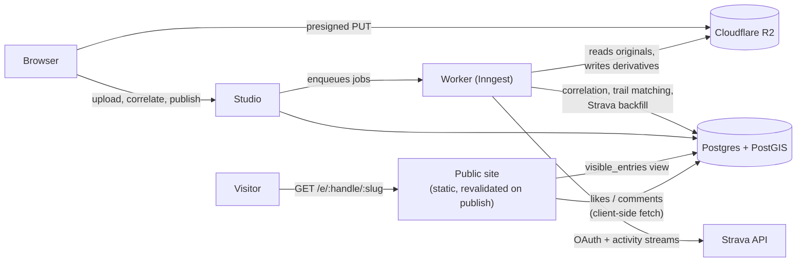
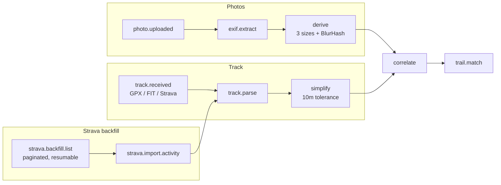

# Waypoint

Dedicated cameras take the best photographs and record the worst metadata. A mirrorless body
writes a capture timestamp and nothing else; the GPS track of the same walk lives in a watch.
Waypoint joins the two — it correlates photo capture times against a GPS track to place every
frame on the route, then builds a journal of outings and trail pages that accumulate visits
over time.

Signup is closed while the product is in beta; accounts are created from invite codes.

## Stack

| Concern | Choice |
|---|---|
| Application | Next.js (TypeScript, App Router) |
| Database | Postgres 16 + PostGIS |
| Object storage | Cloudflare R2 |
| Maps | MapLibre GL + MapTiler |
| Background jobs | Inngest |

The correlation engine is a dependency-free TypeScript library with no database or DOM
coupling, so it is unit-testable against fixtures and can later run on a native client.

## Layout

```
apps/web/            Next.js application
packages/            shared libraries (correlation engine and friends)
db/migrations/       SQL migrations, applied on first boot of the dev database
scripts/             development and verification tooling
fixtures/            GPX tracks and JPGs used by the test suite (untracked)
```

## Architecture

Four pieces, chosen so a 30&nbsp;MB photo batch and a rate-limited third-party
API never sit in the request path of a page a stranger is loading from a
shared link.



- **Public site** and **studio** are the same Next.js deployment, split by
  whether a route is session-gated. Public pages are statically generated
  and revalidated on publish, so a burst of traffic from a shared link never
  touches Postgres — likes and comments are the one exception, fetched
  client-side into reserved space rather than baked into the page (see
  below).
- **The worker** (Inngest) owns everything that shouldn't block an HTTP
  response: EXIF extraction, image derivatives, correlation, trail
  matching, and the paginated Strava backfill. Nothing in this list runs in
  a Vercel function.
- **R2** takes uploads directly from the browser via presigned URLs, so an
  original photo never passes through a serverless request body.

### The job graph

Correlation is a fan-in: it can't resolve a timezone offset from one
photograph in isolation, so it waits for every photo in a batch to have an
extracted timestamp *and* for the track to finish parsing before it runs.



A failed EXIF read marks that one photo `failed` and excludes it from
offset scoring rather than blocking the batch — a batch-level decision like
the timezone search below can't be made photo-by-photo, so one bad file
should not stall the rest.

### Why likes and comments are not baked into the page

Entry pages are read far more often than they're written to, so they're
statically generated. Likes and comments are the opposite — they change
whenever someone visits — and a counter baked into the static HTML would
mean regenerating the page on every like. So the page ships without them
and fetches `/api/entries/:id/social` on mount into a reserved space:
the expensive thing (the page) stays cached, the cheap thing (a count)
stays fresh, and nothing shifts on arrival.

## Getting started

Requires Node 20+, Docker, and `exiftool` (`brew install exiftool`).

```sh
npm install
cp .env.example .env
npm run db:up      # Postgres 16 + PostGIS; first run builds the image (~1 min)
npm run verify     # checks the toolchain, the database, and the fixtures
npm run dev
```

`npm run verify` is the machine-checked half of the current build phase; see
[PHASE-0.md](PHASE-0.md) for the rest.
